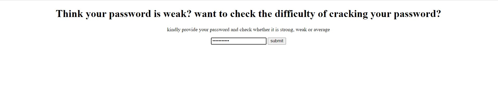

# Password Strength Classifier


## Overview

This Django web application is designed to classify passwords into three categories based on their strength. It utilizes a machine learning model trained on various features of passwords to evaluate their complexity and security level. This guide covers setup, usage, and development instructions.

## Getting Started

### Prerequisites

- Python 3.8+
- Django 3.2+
- TensorFlow 2+
- Scikit-Learn
- Pandas
- NumPy

### Installation

1. Clone the repository:
   ```sh
   git clone <repository-url>
   ```
2. Install required Python packages:
   ```sh
   pip install -r requirements.txt
   ```
3. Navigate to the project directory and run the Django server:
   ```sh
   python manage.py runserver
   ```

### Usage

- Access the web application through your browser at `http://localhost:8000/`.
- Enter a password into the provided input field.
- Submit the form to receive the password strength classification.

## Development

This application is built using Django, a high-level Python web framework that encourages rapid development and clean, pragmatic design. The password strength classification is powered by a TensorFlow model, utilizing a Sequential neural network architecture for categorization.

### Key Components

- `views.py`: Contains the logic to handle requests and responses, including the classification of password strength.
- `models.py`: Defines the data models (if any) used by the application.
- `urls.py`: Configures the URL dispatcher with paths to the application's views.
- `keras_model.py`: Contains the TensorFlow model architecture and training logic used for password strength classification.

### Customizing the Model

The machine learning model can be retrained or adjusted by modifying `keras_model.py`. Ensure you have a dataset of passwords labeled by their strength levels to train the model effectively.

## Contributing

Contributions to improve the application or its underlying model are welcome. Please follow the standard fork-and-pull request workflow on GitHub.

## License

This project is licensed under the MIT License - see the LICENSE.md file for details.

---
